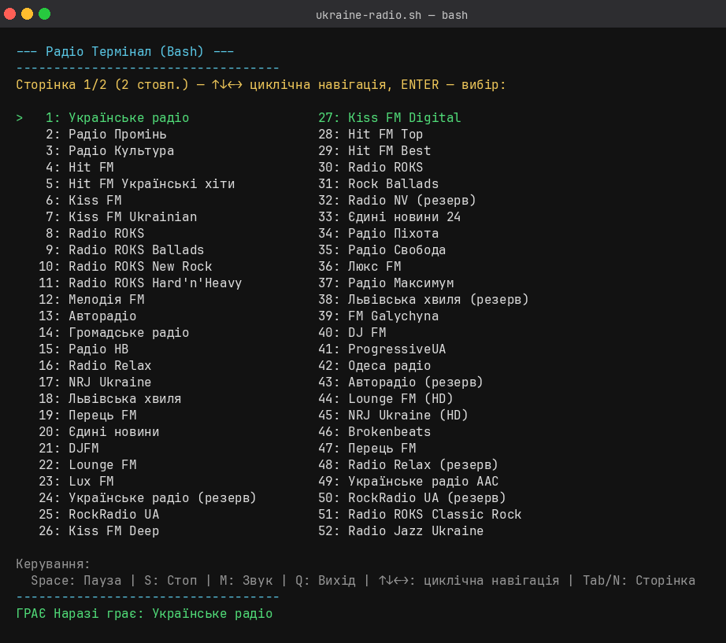

Run in terminal, need mvp player.

chmod +x ukraine-radio.sh

./ukraine-radio.sh

# 🎧 Radio-Bash — українське інтернет-радіо у вашому терміналі

**Radio-Bash** — Bash-скрипт для простого інтерактивного прослуховування десятків онлайн-радіостанцій України через mpv.



## 🚀 Швидкий старт

1. Встановіть [mpv](https://mpv.io/) (необхідний для програвання потоків).
2. Надати права на виконання:
   ```bash
   chmod +x ukraine-radio.sh
   ```
3. Запустіть скрипт:
   ```bash
   ./ukraine-radio.sh
   ```

## 🎵 Можливості

- Великий вибір станцій:  
  100 українських радіопотоків, розбитих на сторінки (по 100 максимум на всі
  сторінки), поділені між кількома стовпчиками.
- **Адаптивна сітка стовпчиків:**  
  Кількість стовпчиків і рядків на сторінці автоматично підлаштовується під
  поточний розмір вікна терміналу (`tput lines`/`tput cols`) — від 1 до 5
  стовпчиків, залежно від ширини вікна та шрифту. При зміні розміру вікна
  (WINCH) розкладка перераховується на льоту, тож меню завжди гарно
  вписується в екран без обрізання.
- Зручне меню управління у терміналі:
  - Навігація стрілками ↑↓←→ — **циклічна**: вихід за межі стовпчика чи
    крайнього стовпчика переносить курсор на протилежний край (зверху↔знизу,
    зліва↔справа)
  - `Tab` або `N` — циклічне перемикання між сторінками
  - Enter — запуск станції
  - Введення номера станції (1-100) одразу перемикає на потрібну сторінку
  - `Space` або `P` — пауза/відновлення потоку
  - `M` — вкл./викл. звук
  - `S` — зупинка
  - `Q` — вихід з програми
- Стан поточного потоку:  
  Показує, яка станція грає, чи стоїть на паузі, чи вимкнено звук.
- Кольорова підсвітка (опціонально).

Список потоків оновлено 21.09.2026. Адреси відібрано з актуальних MP3/AAC-потоків
Radio Browser; окремі станції можуть бути тимчасово недоступні через роботу
стримінгових серверів.

## 🛠️ Вимоги

- Bash (сучасний, із підтримкою функцій tput)
- [mpv](https://mpv.io/)
- (Опційно) [socat](https://linux.die.net/man/1/socat) для сокет-команд до mpv

## 📗 Ліцензія

Випущено у публічному доступі (Public Domain, [Unlicense](https://unlicense.org/)).  
Можна вільно копіювати, змінювати, розповсюджувати та використовувати у комерційних і некомерційних цілях.

---

> Проект створено з любовʼю для всіх, хто цінує українську музику та хоче слухати радіо без браузера!
